**NOTE: This repo is part of [Hello World: GitOps].** It's not intended to be
referenced directly. Instead, check out the organization's page for how this
repository fits into the greater multi-cluster GitOps architecture.

# Boostrap

This repo contains a Helm chart used to bootstrap the Hello World GitOps
multi-cluster OpenShift fleet using Red Hat Advanced Cluster Management (ACM).

The bootstrap Helm chart deploys ACM Subscriptions (Applications) for each of
the three GitOps repos (gitops-hub, gitops-dev, and gitops-stage). These
subscriptions continuously deploy the Argo CD application configurations in
each GitOps repos to each respective cluster.

Additionally, the bootstrap chart deploys an ACM Governance Policy to install
OpenShift GitOps across all ACM managed clusters. This is important since the
GitOps repos being bootstrapped from this chart require OpenShift GitOps.

The bootstrap Helm chart is expected to be manually deployed by an OpenShift
admin only once. Once deployed, ACM will periodically check the GitOps Git
repos for changes and deploy those.

```mermaid
graph TD
        Admin["Admin 🧑‍💻"]
        ACM["Red Hat Advanced Cluster<br />Mangement (ACM) for Kubernetes"]

        subgraph stage [Stage OpenShift Cluster]
        GitOpsStage["OpenShift GitOps<br />(Argo CD)"]
        end

        subgraph hub [Hub Openshift Cluster]
        ACM
        GitOpsHub["OpenShift GitOps<br />(Argo CD)"]
        end

        subgraph dev [Dev OpenShift Cluster]
        GitOpsDev["OpenShift GitOps<br />(Argo CD)"]
        end

        Admin -. "Manually deploys 'bootstrap' chart<br />(This only happens once, everything<br />past this point is automated)" .-> ACM

        ACM -- "Continously deploys<br />'gitops-hub' repo" --> GitOpsHub
        ACM -- "Continously deploys<br />'gitops-dev' repo" --> GitOpsDev
        ACM -- "Continously deploys<br />'gitops-stage' repo" --> GitOpsStage
```

## Deploying

* Log into the hub cluster with `oc`
* Run: `make install`

## Updating

This chart would typically only be deployed once. If an OpenShift cluster is
added or removed, it is necessary to redeploy this chart with updated values.

* Log into the hub cluster with `oc`
* Run: `make upgrade`

[Hello World: GitOps]: https://github.com/hello-world-gitops
